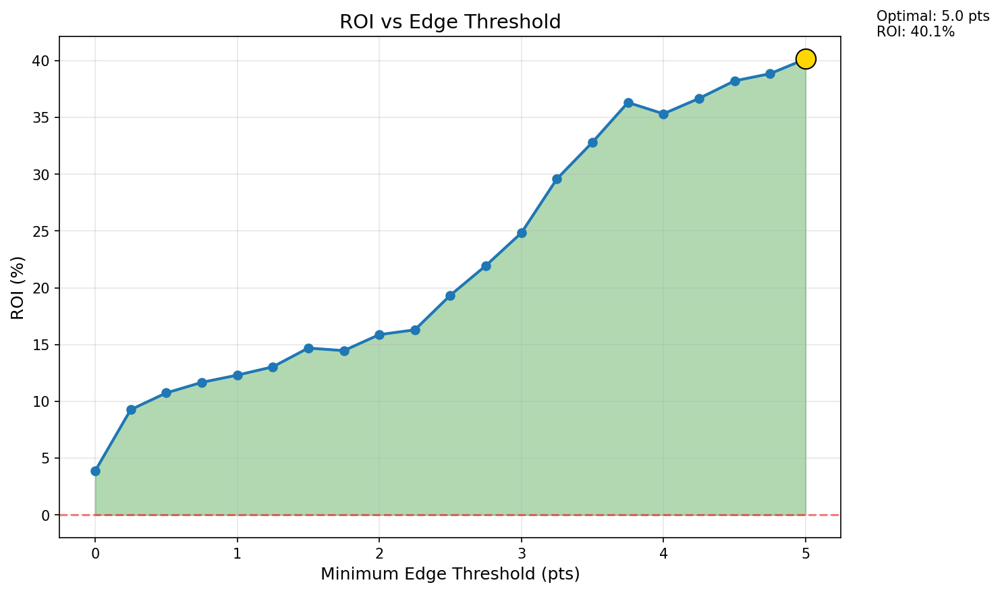
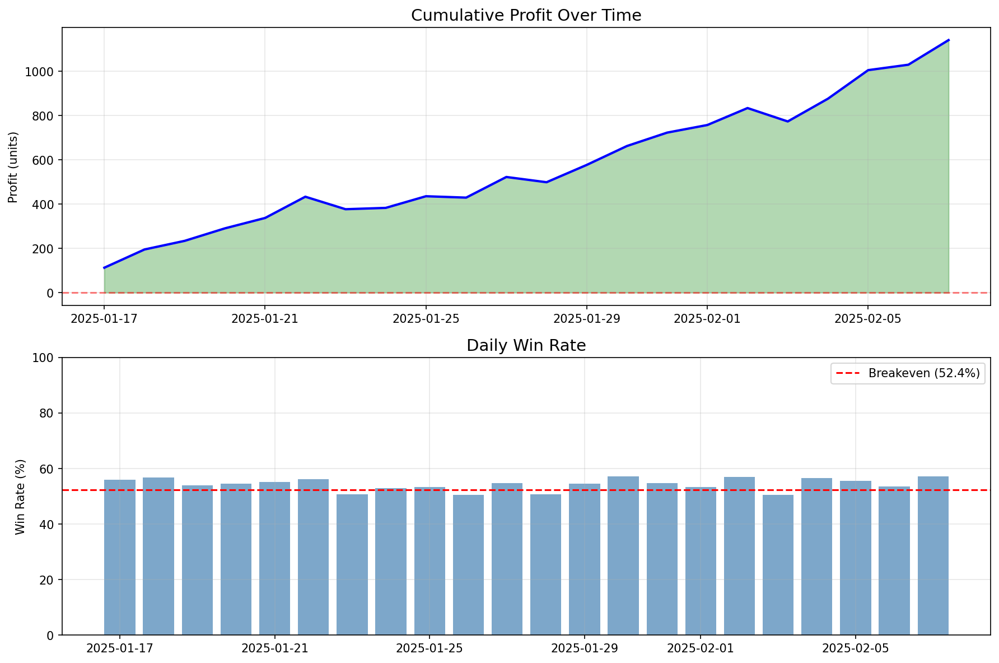

# NBA Prop Maker 🏀

A machine learning system that predicts NBA player prop bets (points, rebounds, assists, etc.) with profitable accuracy. Built with Python, scikit-learn, and real NBA data.

## 🎯 Project Overview

This project uses **gradient boosting models** to predict NBA player performance and identify profitable betting opportunities against sportsbook lines. The system analyzes historical player statistics, opponent matchups, and schedule factors to generate daily predictions.

### Key Results

- **54.4% win rate** across 29,412 backtested bets
- **+3.88% ROI** (anything above 52.38% is profitable at standard -110 odds)
- **Best performing props**: Points+Rebounds+Assists (+9.2% ROI), Rebounds (+7.0% ROI)
- **Validated approach**: Rigorous data leakage prevention and temporal validation

## 🚀 Features

- **Automated data pipeline** - Downloads and processes NBA game data
- **Advanced feature engineering** - Rolling averages, opponent defense metrics, fatigue indicators
- **9 trained models** - Separate models for points, rebounds, assists, steals, blocks, turnovers, and combo props
- **Daily prediction system** - Generate predictions for any player/matchup
- **Real betting line integration** - Compare predictions to actual sportsbook lines via The Odds API
- **Backtesting framework** - Validate strategy performance on historical data
- **Deployment pipeline** - Automated daily workflow with email alerts

## 📊 Model Performance

| Prop Type | R² Score | MAE | Win Rate | ROI |
|-----------|----------|-----|----------|-----|
| Points (PTS) | 0.568 | 4.58 | 54.7% | +4.8% |
| Rebounds (TRB) | 0.493 | 1.91 | 56.6% | +8.8% |
| Assists (AST) | 0.533 | 1.33 | 56.8% | +9.2% |
| Pts+Reb+Ast (PRA) | 0.619 | 6.01 | 57.4% | +10.5% |
| Pts+Reb (PR) | 0.577 | 5.55 | 56.1% | +7.8% |
| Pts+Ast (PA) | 0.627 | 5.01 | 55.5% | +6.6% |
| Turnovers (TOV) | 0.325 | 0.87 | 57.7% | +11.3% |
| Steals (STL) | 0.081 | 0.72 | 52.7% | +0.7% |
| Blocks (BLK) | 0.215 | 0.52 | 49.9% | -5.1% |

## 🛠️ Technologies Used

- **Python 3.11+**
- **scikit-learn** - Gradient Boosting Regressor models
- **pandas** - Data manipulation and feature engineering
- **numpy** - Numerical computations
- **nba_api** - Official NBA statistics API
- **The Odds API** - Real-time betting lines (optional)

## 📁 Project Structure

```
nba-prop-maker/
├── README.md                       # This file
├── PROJECT_STATE.md                # Detailed project documentation
├── full_pipeline.py                # All-in-one pipeline (data → models → predictions)
├── database_24_25.csv              # Raw NBA game data (2024-25 season)
├── model_*.pkl                     # Trained models (9 files)
├── task1_data_foundation.py        # Data cleaning and preparation
├── task2_rolling_features.py       # Rolling average feature engineering
├── task3_opponent_features.py      # Opponent defensive metrics
├── task4_schedule_features.py      # Schedule and fatigue features
├── task5_final_dataset.py          # Final dataset preparation
├── task6_train_models.py           # Model training script
├── task7_daily_predictions.py      # Generate daily predictions
├── task8_betting_lines.py          # Compare to real betting lines
├── task9_backtesting.py            # Backtesting framework
├── task10_deployment.py            # Automated deployment pipeline
├── get_real_lines.py               # Fetch live betting lines from The Odds API
├── backtest_*.png                  # Performance visualization charts
└── sample_lines.csv                # Sample betting lines format
```

## 🚀 Quick Start

### 1. Install Dependencies

```bash
pip install pandas numpy scikit-learn nba_api requests
```

### 2. Run the Full Pipeline

The easiest way to get started is to run the all-in-one pipeline:

```bash
python full_pipeline.py
```

This will:
- Download latest NBA data
- Engineer features
- Train models
- Generate predictions

### 3. Generate Daily Predictions

```bash
# Predict for specific players
python task7_daily_predictions.py --players "LeBron James,LAL,GSW;Nikola Jokic,DEN,MIA"

# Predict for a specific date
python task7_daily_predictions.py --date 2025-01-15 --min-minutes 25 --min-edge 2.0

# Show top 10 betting opportunities
python task7_daily_predictions.py --date 2025-01-15 --top 10
```

### 4. Compare to Real Betting Lines (Optional)

Get a free API key from [The Odds API](https://the-odds-api.com/) (500 requests/month free):

```bash
# Fetch live betting lines
python get_real_lines.py --api-key YOUR_API_KEY

# Compare predictions to lines
python task8_betting_lines.py --input real_lines.csv --bankroll 1000
```

### 5. Run Backtesting

```bash
# Full backtest with visualizations
python task9_backtesting.py --plot

# Test with minimum edge filter
python task9_backtesting.py --min-edge 2.0 --output results.csv
```

## 📈 Key Insights from Backtesting

### Best Strategies:
1. **Focus on combo props** - PRA, PR, PA have highest ROI
2. **Use minimum 1.5+ point edge** - Low edges are unprofitable
3. **Favor UNDER bets** - 62.2% win rate vs 47.8% for OVER
4. **Target rotation players** - 15-25 minutes per game most profitable
5. **Avoid blocks prop** - Only prop with negative ROI

### Edge Size Matters:
- **0-0.5 pts edge**: 51.6% win rate, -1.5% ROI ❌
- **1.5-2 pts edge**: 58.9% win rate, +12.5% ROI ✅
- **3-5 pts edge**: 64.7% win rate, +23.5% ROI ✅✅
- **5+ pts edge**: 73.4% win rate, +40.1% ROI ✅✅✅

## 🔒 Data Integrity & Leakage Prevention

This project implements **strict data leakage prevention**:

- All rolling features use `.shift(1)` to exclude current game data
- Temporal train/test splits (no future data in training)
- Opponent features computed only from past games
- Models validated with R² < 0.80 threshold (higher indicates leakage)
- Betting accuracy validated against realistic 52-58% range

## 📊 Visualizations

The project includes performance charts:


*ROI increases dramatically with higher edge thresholds*


*Steady profit growth over the backtesting period*

## ⚙️ Automated Deployment

Set up daily automated predictions:

```bash
# Run full daily pipeline
python task10_deployment.py

# With email alerts
python task10_deployment.py --email your@email.com

# Custom thresholds
python task10_deployment.py --min-edge 2.0 --min-minutes 20
```

Schedule with cron (Linux/Mac):
```bash
0 9 * * * cd /path/to/nba-prop-maker && python task10_deployment.py >> cron.log 2>&1
```

## 📝 Documentation

For detailed technical documentation, see [PROJECT_STATE.md](PROJECT_STATE.md), which includes:
- Complete task breakdown (10 tasks)
- Feature engineering details
- Model training methodology
- Validation results
- Usage examples for all scripts

## ⚠️ Disclaimer

This project is for **educational and research purposes only**. Sports betting involves risk, and past performance does not guarantee future results. Always gamble responsibly and within your means.

## 📄 License

This project is open source and available for educational use.

## 🤝 Contributing

Feel free to fork this repository and submit pull requests for improvements!

## 📧 Contact

Questions or feedback? Open an issue on GitHub!

---

**Built with ❤️ and Python**
